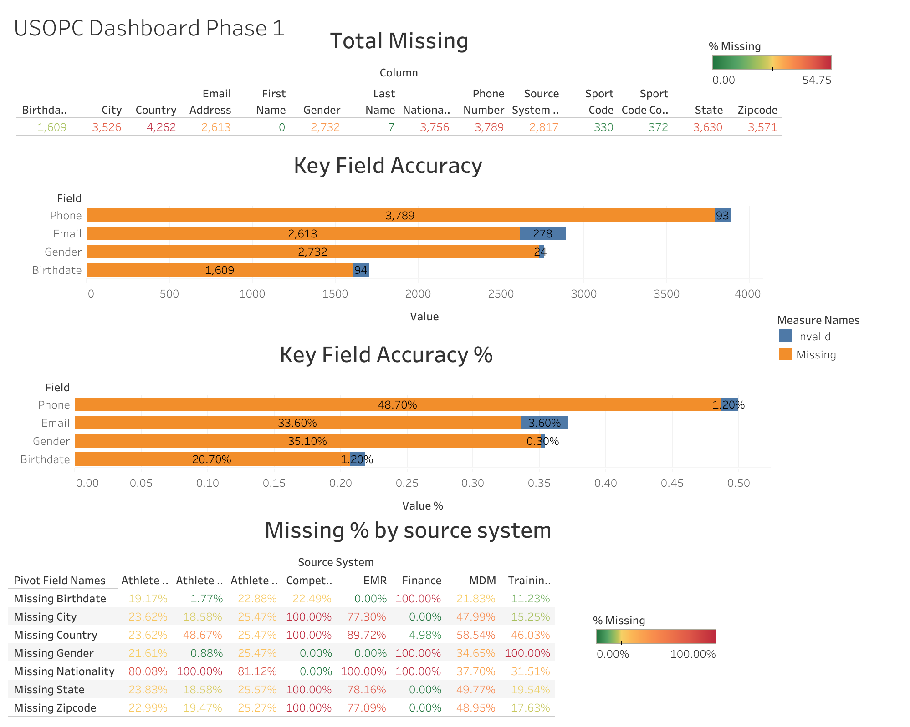

# USOPC Master Data Management (MDM) Data Quality Audit

## 📌 Project Overview
This project focuses on a comprehensive Master Data Management (MDM) data quality audit conducted for the **United States Olympic & Paralympic Committee (USOPC)**. The audit evaluates the consistency, integrity, and reliability of athlete demographic information consolidated into the centralized "Golden Record" from various upstream source systems (e.g., EMR, Finance, Training Center, Athlete Education).

By analyzing missing, invalid, and duplicate data values, this audit identifies critical upstream data-entry vulnerabilities, evaluates matching logic, and delivers tactical recommendations to secure athlete record integrity.

---

## 💼 Business Case Study (STAR Method)

### 📍 Situation
The USOPC integrates athlete records from numerous separate upstream operational systems into a centralized Master Data Management (MDM) hub to build a single "Golden Record" version of the truth. However, variations in system validation rules allowed formatting errors, duplicates, and missing values to flow into downstream reporting, threatening analytics accuracy for high-performance strategy.

### 🎯 Task
Audit the core athlete dataset containing active records across systems to isolate duplicate profiles, quantify the exact missing rates of critical fields (Phone, Email, Gender, Birthdate, Country), validate sport-classification compliance, and establish a framework to resolve upstream data anomalies.

### ⚙️ Actions
*   Queried the `cleaned_USOPC_data.csv` dataset using **SQL** to isolate weak system match-merge constraints and identify duplicate `MDM Person ID` entries.
*   Developed data profiling scripts in **R** to compute metrics for missing values across distinct operational source layers.
*   Cross-referenced unconfirmed sport codes (`COV`, `BLD_P`, `STA`) to assess data validation failures.
*   Built interactive data-quality monitoring dashboards in **Tableau** as a live framework for system data stewards.

### 📊 Results & Business Impact
*   Identified **106 IDs appearing twice** and **5 IDs appearing three times**, signaling minor logic gaps in merge criteria.
*   Discovered combined **missing/invalid rates near 50% for Phone and Country fields** due to unstandardized free-text entries upstream.
*   Mapped system exception spikes showing that certain source domains inherited isolated field missing rates near 100%.
*   Delivered a data governance playbook defining strict string regex constraints, mandatory entry controls, and a single standardized layout (`YYYY-MM-DD`) for Immediate 0-3 Month implementation.

---

## 🛠️ Data Structure & Audit Fields
The analysis utilized the `cleaned_USOPC_data.csv` core matrix, focusing on the following attributes:
*   **Identifiers:** `MDM Person ID`, `Source System ID`, `Source System`
*   **Demographics:** `First Name`, `Last Name`, `Gender`, `Birthdate`, `Nationality`, `Country`
*   **Contact Fields:** `Phone Number`, `Email Address`, `City`, `State`, `Zipcode`
*   **Governance Categorizations:** `Sport Code`, `Sport Code Conformed`, `Active`

---

## 🔍 Core Audit Findings

### 🛑 Key Field Accuracy & Missing Rates
| Field | Missing/Invalid Rate | Data Status Insight |
| :--- | :--- | :--- |
| **Phone Number** | **48.70%** | Critical formatting issues; letters, incomplete digits, or special symbols. |
| **Country / City** | **35.10% - 54.75%** | Spelling variations (e.g., USA vs USAA), missing geographic identifiers. |
| **Email Address** | **3.60%** | High baseline compliance, minor regex discrepancies. |
| **Gender** | **0.30%** | High completeness, but manual variations exist. |
| **Birthdate** | **~20.70% Missing** | Significant chunk of profiles defaults to placeholder values (e.g., `1900-01-01`). |

---

## 🖥️ Dashboard Visualization

---

## 🎯 Strategic Action Roadmap

### ⚡ Quick Wins (0-3 Months)
*   **Birthdate Validation:** Mandate uniform ISO standard `YYYY-MM-DD` entry formats and programmatically reject future/implausible dates.
*   **Phone Standardization:** Enforce numeric-only 10-digit fields at entry points, stripping non-numeric punctuation upon backend ingestion.
*   **Sport Code Correction:** Re-verify and map unconfirmed identifiers (`COV`, `BLD_P`, `STA`) back to official international codes.

### 🗺️ Long-Term Governance (3-12 Months)
*   Establish a centralized **USOPC Data Stewardship Council** to publish an official corporate data dictionary.
*   Embed automated pipeline quality checks directly inside nightly ETL / Tableau Prep flows to catch upstream drift.
